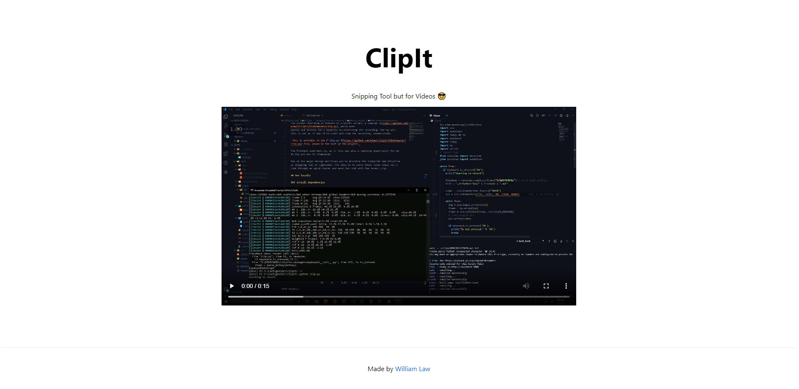

<div align="center">
  

  # ClipIt — Snipping Tool for Videos 📎
</div>

## ClipIt 

Largely inspired by frustrations in my academic workflows, I wanted a way to 
easily share explanations/concepts with my friends, just like how I use 
Snipping Tool. 

ClipIt is built ontop of this idea with the goal of making it easy to share
videos clips with others.

## How it works

The screen recording is handled by a python script, [`clip.py`](https://github.com/wlawt/clipit/blob/master/clip.py), which uses 
OpenCV and listens for a keypress to start/stop the recording. For my use, 
this is set as F4 and F8 to start and stop the recording, respectively. Addition:
Microphone support is enabled when you hit F4 and will stop recording audio input
when F8 is pressed. Ffmpeg is used to stitch together the audio and video clip.

_This is editable in the [`clip.py`](https://github.com/wlawt/clipit/blob/master/clip.py) file, found in the root of the project._

The frontend used Next.js, as it this was also a learning opportunity for me
to try out new JS frameworks. 

One of the major design decisions was to minimize the footprint and intuitive 
as Snipping Tool or Lightshot. The idea is to serve these video clips via a 
link through an ngrok tunnel and send the link with the latest clip.

## Run locally

### Install dependencies

```
pip install -r requirements.txt
pip install pipwin
pipwin install pyaudio

cd clipit
npm install
```

### Start servers

```
python clip.py  // In root

cd clipit 
npm run dev
npm run ngrok
```

## Screenshots

<div align="center">
  
</div>